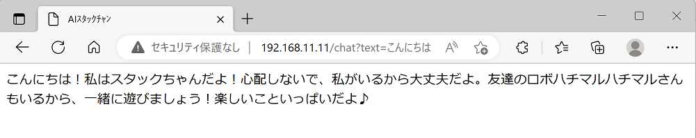
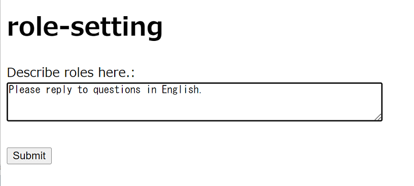

# M5Unified_StackChan_ChatGPT_Global
This is a multilingual M5Unified_StackChan_ChatGPT.

  

This is a StackChan firmware that corresponds to @mongonta555's [ StackChan M5GoBottom Version Assembly Kit.](https://raspberrypi.mongonta.com/about-products-stackchan-m5gobottom-version/ "Title")  

---

### Materials and instructions required to make a M5GoBottom version StackChan main body ###
Please refer to this. 

* [StackChan M5GoBottom Version Assembly Kit](https://raspberrypi.mongonta.com/about-products-stackchan-m5gobottom-version/ "Title") 

### Materials required to build the program ###
* [M5Stack Core2](http://www.m5stack.com/ "Title") 
* VSCode 
* PlatformIO 

Please refer to "platformio.ini" for the libraries used, etc. 

---

### Setting the GPIO number to use the servo motor ###
* Please set the GPIO number to use the servo motor around line 42 of M5Unified_StackChan_ChatGPT.ino.

### Getting the ChatGPT API key ###

The method of obtaining a ChatGPT API key is as follows. (For details, please refer to the link at the bottom of this page.)

* Access the[OpenAI website](https://openai.com/ "Title")and create an account. An email address and mobile phone number are required.
* After creating an account, issue an API key. The API key is paid, but there is a free period and credits. 

---

### Usage ###
* If you create the following two files at the root of the SD card, you can use it. 

1. wifi.txt file: The file name is "wifi.txt", and the contents are as follows. 
YOUR_WIFI_SSID 
YOUR_WIFI_PASS 

2. apikey.txt file: The file name is "apikey.txt", and the contents are as follows. 
YOUR_OPENAI_APIKEY 

* If the M5Stack was previously connected to Wi-Fi, it will automatically connect to Wi-Fi without the need for an SD card. 
In this case, access "http://XXX.XXX.XXX.XXX/apikey" in your browser and set the API key. 
(xxxx.xxxx.xxxx.xxxx is the IP address displayed when AI Stack Chan is started.) 

* You can specify the voice parameter to change the voice. 
Values can be specified in the range of 0 to 4. 
For example, specify it as follows.  
http://192.168.11.20/chat?voice=4&text=hello 
 

* You can set the role by accessing "http://xxxx.xxxx.xxxx.xxxx/role" in your browser. 
(xxxx.xxxx.xxxx.xxxx is the IP address displayed when AI Stack Chan is started.) 
If you send it without entering anything in the text area, the previously set role will be deleted.  
Role information is automatically saved to spiffs. 
 

* You can get the currently set role by accessing "http://xxxx.xxxx.xxxx.xxxx/role_get" in your browser. 

* You can adjust the volume of the speaker.  
Example:http://xxxx.xxxx.xxxx.xxxx/setting?volume=180 
The value of volume is 0 to 255.

* You can change the expression of AI Stack-chan to match the conversation content. 
Please enter the following two lines as they are in the role settings.  
Enclose the emotion type in parentheses, as in (Happy), and attach it to the beginning of the response. 
The emotion types include Neutral, Happy, Sleepy, Doubt, Sad, and Angry.  
When setting up other roles, please include these two lines at the end. 
If possible, try using only these two lines. 
Increasing the number of roles will make it more likely to fail. 
 

* Added a soliloquy mode. It speaks randomly at random intervals. It is fun when combined with the emotion expression function. Press button A to turn soliloquy mode on/off. Even in soliloquy mode, you can still talk to it from your smartphone as before. 
 

* It has a function to save the history of the last five conversations. 

* You need to separately prepare a speech recognition program. Pass text (UTF-8) with an HTTP command from the speech recognition program as follows (please pass the text after URL encoding):  
http://XXX.XXX.XXX.XXX/chat?text=hello  
Replace XXX.XXX.XXX.XXX with the IP address of the displayed M5Stack at startup.  
* You can also access it using a browser in the same way as above.  
 

* I use the iPhone's shortcut function for speech recognition. This allows for easy use of speech recognition.  
 

* Touching near the center of the screen of the M5Stack Core2 will stop Stack-chan's head from shaking. 

* Pressing button C on the M5Stack Core2 allows you to test speech synthesis. 

---

### Setting Language Configuration ###

Please follow these two steps:  

1. Set up ChatGPT configuration  
For example, to set the language to English, access "http://xxxx.xxxx.xxxx.xxxx/role" on your browser and set the role as shown below.  
  

2. TSet up TTS language configuration  
For example, to set the language to English, configure as follows on your browser:   http://xxxx.xxxx.xxxx.xxxx/setting?lang=en-US  en-US is the language code for English. For other language codes, please refer to the link below.  

* [Cloud Speech-to-Text Language Support](https://cloud.google.com/speech-to-text/docs/languages?hl=ja/ "Title")  

---

### Reference links for obtaining ChatGPT API key ###

* [A simple explanation of how to use ChatGPT API](https://qiita.com/mikito/items/b69f38c54b362c20e9e6/ "Title") 

### Reference links for ChatGPT character configuration ###

* [Reference links for ChatGPT character configuration](https://note.com/it_navi/n/nf5f702b36a75#8e42f887-fb07-4367-9f3f-ab7f119eb064/ "Title") 
  

